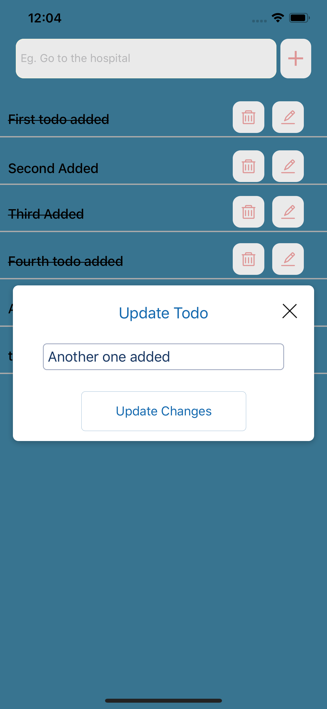

# react-native-redux-todo-firebase

A basic react native todo app using Redux 

  - Redux to manage state
  - Splitted reducers to handle different states specifically - Used combineRedcers to combine the different reducers so as to act similar to that of a single reducer to make it more readable
  - Used connect() to connect the React component to a Redux store and then dispatch actions to create the todo
  - Used action creators and action types for proper code management and better readability
  - Firebase CRUD Operations

## Features

  - Add Todos and display the list with the help of firebase and redux
  - Mark todos complete and incomplete with the help of firebase and redux
  - Delete todos from the list using redux and firebase
  - Update todos using redux and firebase

## Installation

The app was developed with [Node.js](https://nodejs.org/) v12+ .

Make sure you have ``` expo-cli ``` installed. If not, run ``` npm install -g expo-cli ``` to install ``` expo-cli ``` globally. 
Also to install ``` yarn ``` globally, run ``` npm install -g yarn ```. You can use ``` npm ``` instead of ``` yarn ``` as well.

**Step 1 :** Clone the repo and change your directory running the following commands: 
```sh
git clone https://github.com/dilipthakur87/react-native-redux-todo-firebase.git
cd react-native-redux-todo-firebase
```
**Step 2 :** Goto [Firebase](https://firebase.google.com/) Console, log in from your Google Account and a create a new project.

**Step 3 :** Add the database configuration in a new file ``` src/config.js ```
- The config object is where you fill in the details you get after creating a new project in Firebase and going to the section Add Firebase to your web app.
```js
import Firebse from 'firebase';

let firebaseConfig = {
  apiKey: 'AIzaXXXXXXXXXXXXXXXXXXXXXXX',
  authDomain: 'rnfirebXXX-XXXX.firebaseapp.com',
  databaseURL: 'rnfirebXXX-XXXX.firebaseapp.com',
  projectId: 'rnfirebase-XXXX',
  storageBucket: 'rnfirebase-XXXX.appspot.com',
  messagingSenderId: 'XXXXXXX'
};
  
// Initialize Firebase
let app = Firebse.initializeApp(firebaseConfig);

export const dbRef = app.database();
```

**Step 4 :** Install the dependencies and run the server using the following commands: 
```sh
# using yarn
yarn install
yarn start

# using npm (make sure to remove yarn.lock file if present while using npm)
npm install 
npm start
```
After this you can scan the qr to run the app on you phone. Make sure you have installed expo client on your phone.

### App Screens (iPhone Screenshots - Simulator)
<div>
    
    
    
</div>

## Todos

 - Filter todolist based on the status (completed/incomplete/both)
 - Write tests

 ## Tips for deleting sensitive file from github and commit history without affecting the local files and features added during same commit.

 **Issue Faced :** I accidently pushed my config file to git without adding it to the gitignore file. I tried to remove it but it still was there in the commit history. So I had to delete that specific file without affecting any feature changes and commit message, from git while reflecting no changes to my local file. 
 
 **How I solved it :**
 ```sh
 git filter-branch --force --index-filter \
  "git rm --cached --ignore-unmatch PATH-TO-YOUR-FILE-WITH-SENSITIVE-DATA" \
  --prune-empty --tag-name-filter cat -- --all
 git push --force --verbose --dry-run
 git push --force
 ```

License
----

**Free Software, Hell Yeah!**